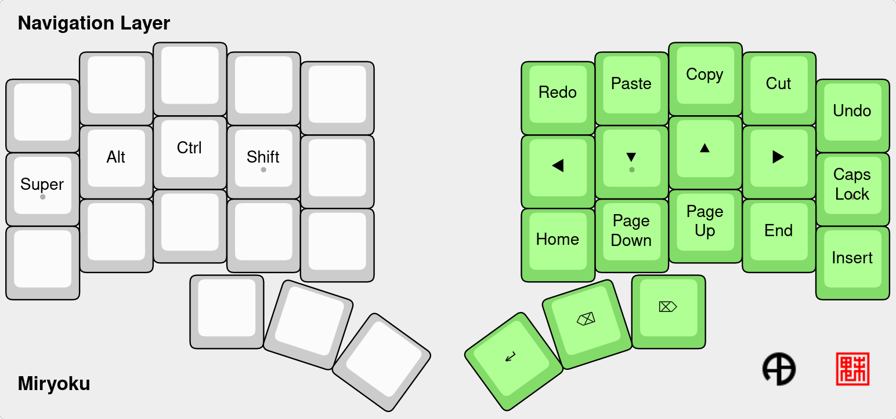
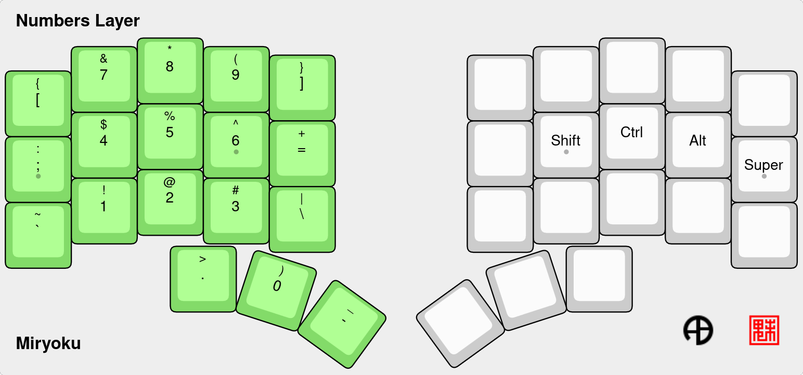

#   My Piantor Miryoku layout for QMK

- Don’t connect or disconnect the TRRS cable when the keyboard is powered. Always disconnect the USB cable first.
- Flash the firmware on both Raspberry Pi Picos.
- Enter the bootloader mode by holding down the BOOTSEL button while reconnecting the board into USB port.

https://github.com/beekeeb/piantor

https://github.com/qmk/qmk_firmware/tree/master/keyboards/beekeeb/piantor

## Keyboard Layers App companion

Display the selected keyboard layer layout on screen to assist your to memorize the key's locations.

It allows you to display the layout in a remote screen, so you can use a tablet or similar to save space on your main screen.

Details here: https://github.com/maatthc/miryoku_qmk_app

## Compile and Flash

### Install and setup
- Install QMK:
`python3 -m pip install qmk`

- Set this folder as an userspace:
`qmk config user.overlay_dir="$(realpath qmk_userspace)"`

- Set up QMK:
`cd ..; qmk setup`

### Compile
`qmk compile -c -kb beekeeb/piantor -km manna_harbour_miryoku`

### Flash
`qmk flash -c -kb beekeeb/piantor -km manna_harbour_miryoku`

### Check debug logs
`qmk console`

### info

`qmk info -kb beekeeb/piantor -km manna_harbour_miryoku`

## Configuration

Details: ./users/manna_harbour_miryoku#userspace

- users/manna_harbour_miryoku/custom_config.h
- users/manna_harbour_miryoku/custom_rules.mk
- keyboards/beekeeb/piantor/keymaps/manna_harbour_miryoku/config.h
- keyboards/beekeeb/piantor/keymaps/manna_harbour_miryoku/keymap.c

### Typing Test

https://config.qmk.fm/#/test

### Symbols that correspond to keycodes available in QMK.
https://docs.qmk.fm/keycodes

## Generated Layout/Layers images

Json files and images at: ./data/layers/

- 

- 

- 

- 

- 

- 

- 

