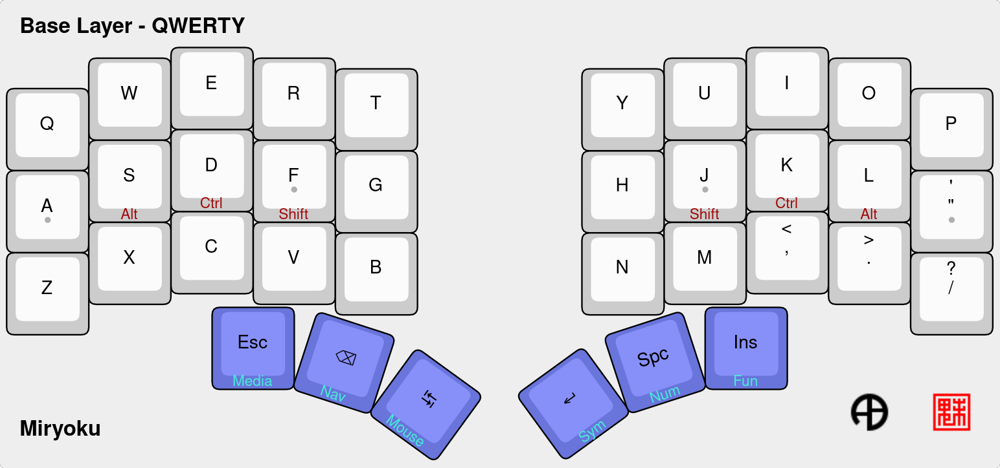
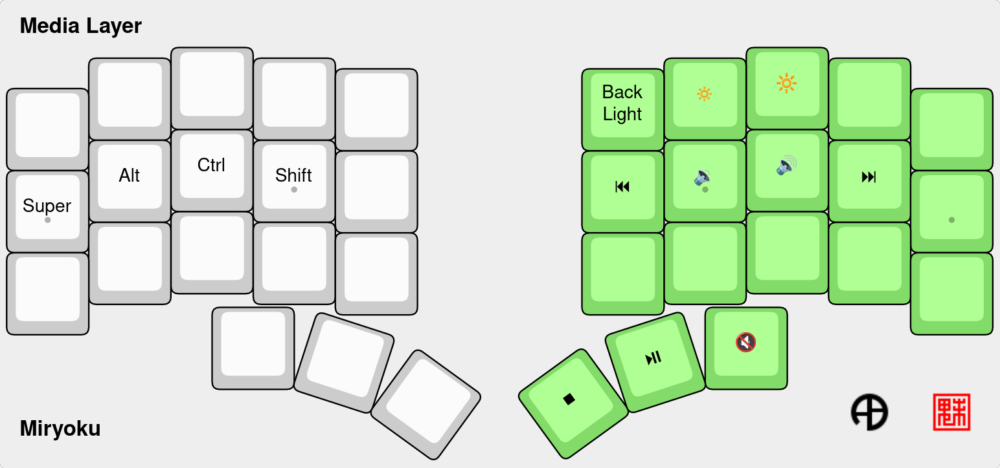
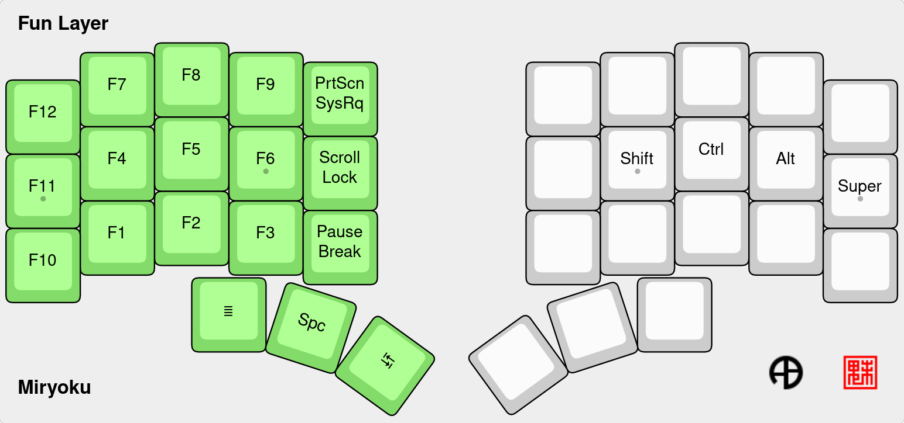

#   My QMK keyboard layout

This is a QWERTY Miryoku-inspired layout optimized for ergonomics.

It's a Split 3x6_3 with the outer columns dedicated to Window management shortcuts.

It features:

- Predictive Tap Hold: Faster tap/hold decisions
- Home row mods 
- Layer-tap keys: Hold thumb keys to access layers, tap for the base key
- Raw HID: Layer state communication to a companion app

Remember:

- Don’t connect or disconnect the TRRS cable when the keyboard is powered. Always disconnect the USB cable first.
- Flash the firmware on both sides.



## Keyboards

- [ Piantor ](./keyboards/beekeeb/piantor/readme.md)
- [ Corne ](./keyboards/crkbd/rev1/readme.md)

## Keyboard Layers App companion

Display the selected keyboard layer layout on screen to assist your to memorize the key's locations.

It allows you to display the layout in a remote screen, so you can use a tablet or similar to save space on your main screen.

Details here: https://github.com/maatthc/miryoku_qmk_app

## Compile and Flash

### Install and setup
- Install QMK:
`python3 -m pip install qmk`

- Initialize the sub-modules:
`git submodule update --init --recursive`

- Set this folder as an userspace:
`qmk config user.overlay_dir="$(realpath qmk_userspace)"`

- Set up QMK:
`cd ..; qmk setup`

#### Piantor
```
export KEYBOARD="beekeeb/piantor"
```
#### Corne 

```
export KEYBOARD="crkbd/rev1"
```

##### Compile with GCC v8.3.0
Generates a firmware considerably smaller (~1.5k):

```
./install_avr_8.3.0.sh
export PATH=${PWD}/avr_toolchain/bin:$PATH
```

### Compile
`qmk compile -kb $KEYBOARD -km maat`

### Flash
`qmk flash -kb $KEYBOARD -km maat`

### Generates the Clang compile_commands.json
`qmk compile --compiledb -kb $KEYBOARD -km maat`

### Check debug logs
`qmk console`

### info

`qmk info -kb $KEYBOARD -km maat`

## Configuration

- ./users/maat/
- ./keyboards/beekeeb/piantor/keymaps/maat/
- ./keyboards/crkbd/rev1/keymaps/maat/

### Typing Test

https://config.qmk.fm/#/test

### Symbols that correspond to keycodes available in QMK.
https://docs.qmk.fm/keycodes

## All Layers

Definitions (.json) files at: ./data/layers/

Images generated with [KLE NG](https://editor.keyboard-tools.xyz/)







